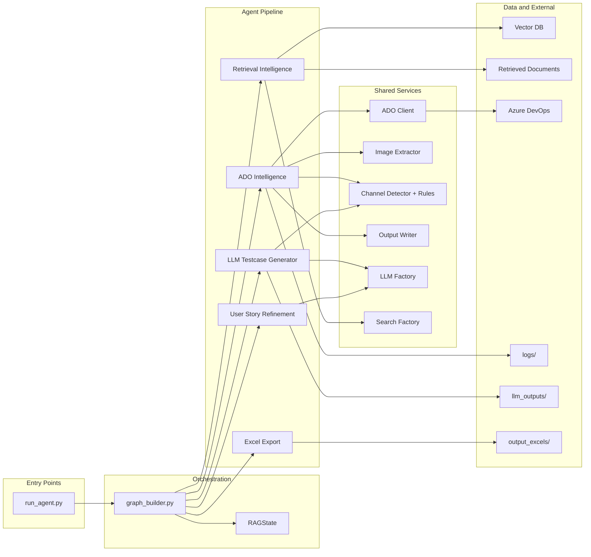

```mermaid
flowchart LR
    %% Layer 1: Entry points
    subgraph L1[Entry Points]
        CLI[run_agent.py]
    end

    %% Layer 2: Runtime orchestration
    subgraph L2[Orchestration]
        GRAPH[graph_builder.py]
        STATE[RAGState]
    end

    %% Layer 3: Agent pipeline
    subgraph L3[Agent Pipeline]
        ADO[ADO Intelligence]
        RET[Retrieval Intelligence]
        LLM[LLM Testcase Generator]
        REF[User Story Refinement]
        XLS[Excel Export]
    end

    %% Layer 4: Shared services
    subgraph L4[Shared Services]
        ADO_CLIENT[ADO Client]
        IMG[Image Extractor]
        CH[Channel Detector + Rules]
        OWR[Output Writer]
        LLM_F[LLM Factory]
        SEARCH_F[Search Factory]
    end

    %% Layer 5: Data + external systems
    subgraph L5[Data and External]
        VDB[Vector DB]
        DOCS[Retrieved Documents]
        ADO_EXT[Azure DevOps]
        LOGS[logs/]
        OUT_TXT[llm_outputs/]
        OUT_XLS[output_excels/]
    end

    CLI --> GRAPH

    GRAPH --> STATE
    GRAPH --> ADO
    GRAPH --> RET
    GRAPH --> LLM
    GRAPH --> REF
    GRAPH --> XLS

    ADO --> ADO_CLIENT
    ADO --> IMG
    ADO --> CH
    ADO --> OWR

    RET --> SEARCH_F
    RET --> VDB
    RET --> DOCS

    LLM --> LLM_F
    LLM --> CH
    REF --> LLM_F

    XLS --> OUT_XLS
    ADO --> LOGS
    LLM --> OUT_TXT

    ADO_CLIENT --> ADO_EXT
```
